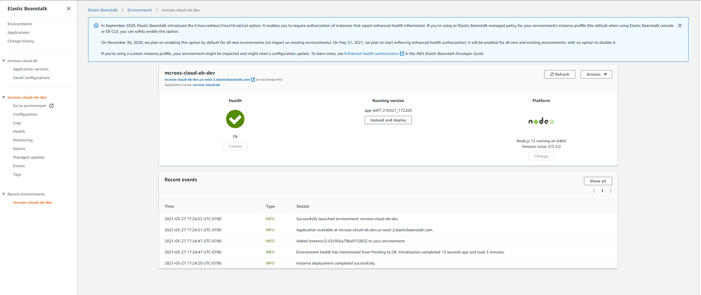

# Udagram Image Filtering Microservice

The final project for the course. It is a Node-Express application which runs a simple script to process images.

## Tasks

### Setup Node Environment

You'll need to create a new node server. Open a new terminal within the project directory and run:

1. Initialize a new project: `npm i`
2. run the development server with `npm run dev`


### Deploying the project

```
$eb init 
$eb create
```

To deploy changesa

```
$eb deploy
```

__EB Deployment Dashboard__


### End points
[EB Endpoint](http://mcroos-cloud-eb-dev.us-west-2.elasticbeanstalk.com/)[Raw Endpoint]

[Filter Image Example](http://mcroos-cloud-eb-dev.us-west-2.elasticbeanstalk.com/filteredimage?image_url=https://upload.wikimedia.org/wikipedia/en/a/a9/Example.jpg)[Success 200]

[Bad Request Example](http://mcroos-cloud-eb-dev.us-west-2.elasticbeanstalk.com/filteredimage?image_url=https://upload.wikimedia.org/wikipedia/en/a/a9/Example.jp)[Failure: 422]

[Missing image URL](http://mcroos-cloud-eb-dev.us-west-2.elasticbeanstalk.com/filteredimage)[Failure 404]


